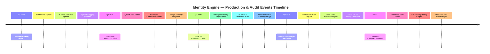
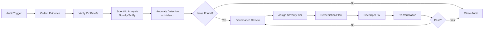
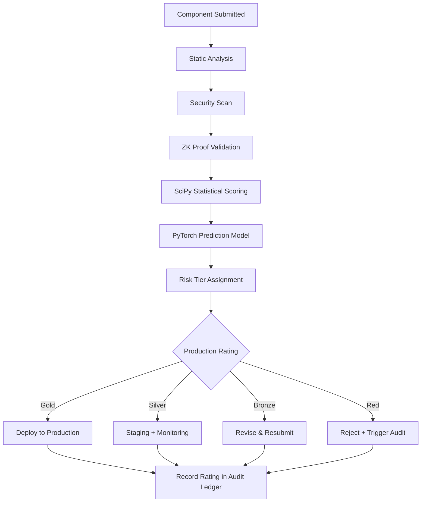

```mermaid
timeline
    title Expanded Production Timeline (Large Format)

    Q1 2026 :
        Core Scientific Stack  
        - NumPy  
        - SciPy  
        - pandas  
        Cryptographic Layer  
        - ZK Bindings  
        - PyCryptodome  
        Identity Mask Prototypes  
        - Identity  
        - Device  
        - Action  

    Q2 2026 :
        PyTorch Adaptive Models  
        Trust-Score Engine  
        Device & Action Embeddings  
        Simulation Framework (SimPy)  
        Expanded Episode Logging  

    Q3 2026 :
        Governance Engine  
        - Risk Tiers  
        - Trust Curves  
        - Compliance Flags  
        zk-Badge Authority  
        Identity Graph Modeling (NetworkX)  
        Attack Simulation Suite  

    Q4 2026 :
        Production Rating v2  
        Autonomous Audit Triggers  
        Trust Curve Evolution Engine  
        Cross-Device Identity Federation  

    2027+ :
        Continuous Compliance Engine  
        Distributed Audit Nodes  
        Self-Healing Identity Graphs  
        Protocol-Grade Event Ledger
```

```mermaid
timeline
  title Identity Engine — Production & Audit Events Timeline

  Q1 2026 : Production Rating Engine v1
            Audit Intake System
            ZK Proof Validation Pipeline
            Episode Logging (pandas)

  Q2 2026 : Trust-Score Calibration (SciPy)
            PyTorch Risk Models
            Developer Contribution Proofs
            Badge Authority Integration

  Q3 2026 : Full Audit Examination Suite
            Multi-Agent Identity Graph Events
            Governance Escalation Rules
            Attack Simulation Events (SimPy)

  Q4 2026 : Production Rating v2 (Adaptive)
            Autonomous Audit Triggers
            Trust Curve Evolution Engine
            Cross-Device Identity Federation

  2027+   : Continuous Compliance Engine
            Distributed Audit Nodes
            Self-Healing Identity Graphs
            Protocol-Grade Event Ledger
```

```mermaid
flowchart LR
    A[Audit Trigger] --> B[Collect Evidence]
    B --> C[Verify ZK Proofs]
    C --> D[Scientific Analysis<br/>NumPy/SciPy]
    D --> E[Anomaly Detection<br/>scikit-learn]

    E --> F{Issue Found?}
    F -->|No| G[Close Audit]
    F -->|Yes| H[Governance Review]

    H --> I[Assign Severity Tier]
    I --> J[Remediation Plan]
    J --> K[Developer Fix]

    K --> L[Re-Verification]
    L --> M{Pass?}
    M -->|Yes| G
    M -->|No| H
```

```mermaid
flowchart TD
    A[Component Submitted] --> B[Static Analysis]
    B --> C[Security Scan]
    C --> D[ZK Proof Validation]
    D --> E[SciPy Statistical Scoring]

    E --> F[PyTorch Prediction Model]
    F --> G[Risk Tier Assignment]

    G --> H{Production Rating}
    H -->|Gold| I[Deploy to Production]
    H -->|Silver| J[Staging + Monitoring]
    H -->|Bronze| K[Revise & Resubmit]
    H -->|Red| L[Reject + Trigger Audit]

    I --> M[Record Rating in Audit Ledger]
    J --> M
    K --> M
    L --> M
```
